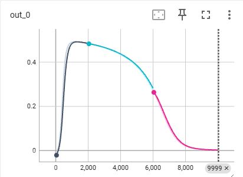
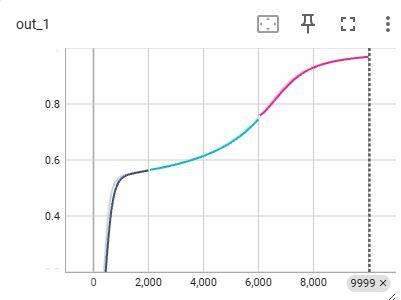
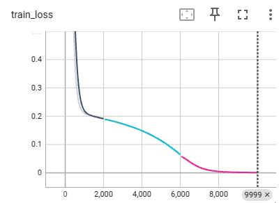
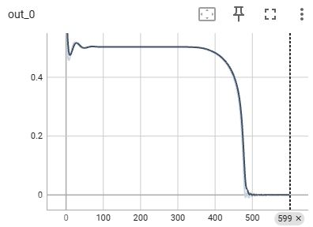
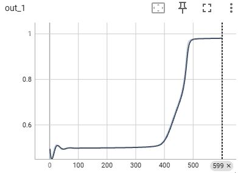
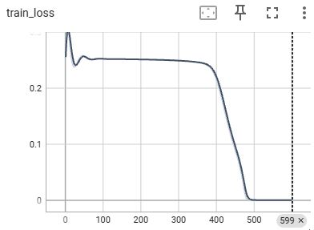

# PyTorch + Lightning – LSTM From Scratch and Native LSTM

This repository demonstrates two contrasting implementations of Long Short-Term Memory (LSTM) networks for time series modeling using PyTorch Lightning:

- `LSTMbyHand.py`: A manual implementation that constructs each component of an LSTM cell step-by-step.
- `LightningLSTM.py`: A standard implementation using PyTorch’s built-in `nn.LSTM`.

The models are trained on toy time series data inspired by [StatQuest's LSTM tutorial](https://www.youtube.com/StatQuest), with the goal of predicting the fifth-day value for two synthetic "companies".

---

## 🧠 Model Architectures

### `LSTMbyHand.py`
- Fully manual LSTM logic
- Custom parameters for:
  - Long-Term Memory Gate
  - Potential Memory Gate
  - Output Gate
- Implemented as a PyTorch Lightning `LightningModule`

<p align="center">
  
</p>

### `LightningLSTM.py`
- Uses PyTorch’s native `nn.LSTM` layer
- Input shape reshaped to match `(seq_len, batch, input_size)`
- Only final output (`output[-1]`) is used for prediction

---

## 📈 Training Data

We use a toy dataset for two hypothetical companies:

- **Company A:** Oscillating pattern, ends low
- **Company B:** V-shaped recovery, ends high

<p align="center">
  
  
</p>

Input sequences:
[0.0, 0.5, 0.25, 1.0]
[1.0, 0.5, 0.25, 1.0]

Labels:
0.0 (Company A), 1.0 (Company B)


---
```
## 🗂 File Structure
├── images/
│ ├── LSTM_model.jpg # Manual LSTM diagram
│ ├── company-a.png # Company A input chart
│ ├── company-b.png # Company B input chart
│ ├── LSTM_out_0.JPG # PyTorch LSTM output (label=0)
│ ├── LSTM_out_1.JPG # PyTorch LSTM output (label=1)
│ ├── LSTM_TrainLoss.JPG # PyTorch LSTM training loss
│ ├── LSTMbyHand_out_0.JPG # Manual LSTM output (label=0)
│ ├── LSTMbyHand_out_1.JPG # Manual LSTM output (label=1)
│ ├── LSTMbyHand_TrainLoss.JPG # Manual LSTM training loss
├── manual_lstm_lightning.py # Manual LSTM implementation
├── pytorch_lstm_lightning.py.py # PyTorch native LSTM implementation
└── README.md
```


---

## 🚀 How to Run

Install required packages:

```bash
pip install torch lightning matplotlib seaborn tensorboard

Then train each model:
python LSTMbyHand.py
python LightningLSTM.py

View results:
tensorboard --logdir=lightningLSTMbyHand_logs
tensorboard --logdir=LightningLSTM_logs

## 📊 Sample Outputs

### 🔧 Manual LSTM

| Label = 0 Output | Label = 1 Output | Training Loss |
|------------------|------------------|----------------|
|  |  |  |

### ⚙️ PyTorch LSTM

| Label = 0 Output | Label = 1 Output | Training Loss |
|------------------|------------------|----------------|
|  |  |  |

## 📝 Credits

- Data and model concept based on [StatQuest's LSTM tutorial](https://www.youtube.com/watch?v=RHGiXPuo_pI&list=PLblh5JKOoLUIxGDQs4LFFD--41Vzf-ME1&index=31)
