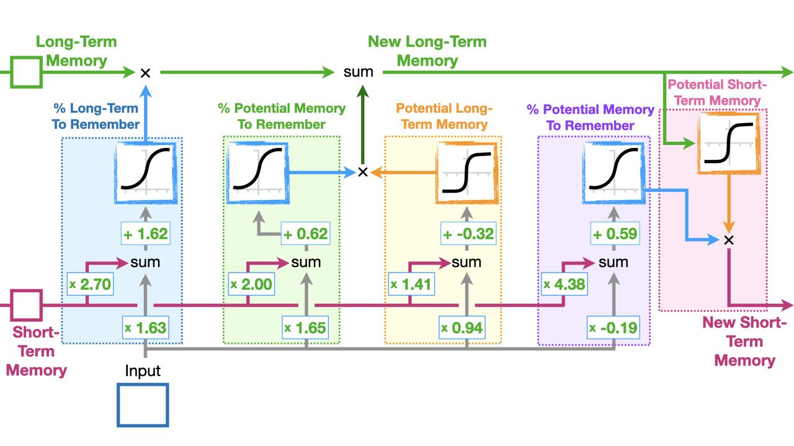
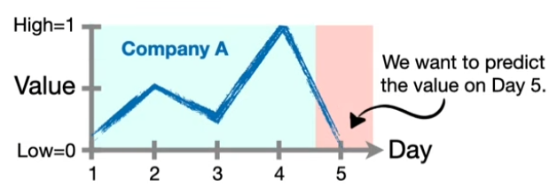
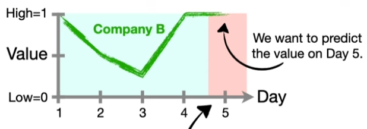
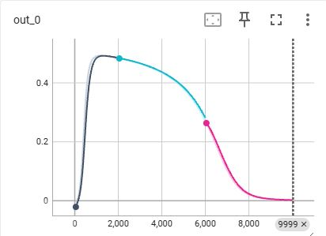
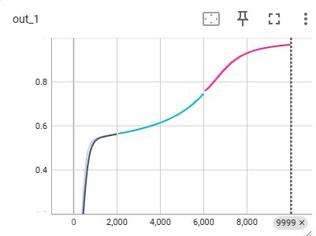
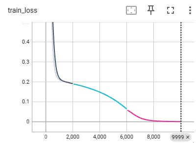
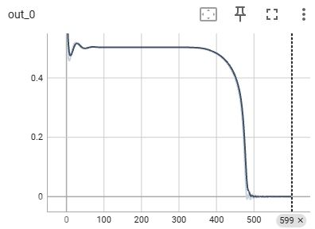
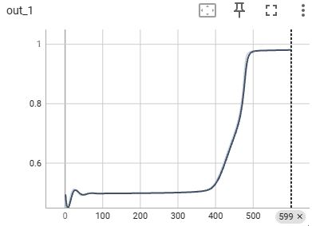
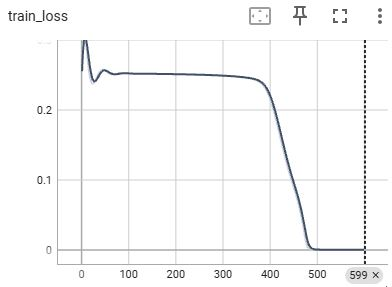

# PyTorch + Lightning – LSTM From Scratch and Native LSTM

This repository demonstrates two contrasting implementations of Long Short-Term Memory (LSTM) networks for time series modeling using PyTorch Lightning:

- `manual_lstm_lightning.py`: A manual implementation that constructs each component of an LSTM cell step-by-step.
- `pytorch_lstm_lightning.py`: A standard implementation using PyTorch’s built-in `nn.LSTM`.

The models are trained on toy time series data inspired by [StatQuest's LSTM tutorial](https://www.youtube.com/watch?v=RHGiXPuo_pI&list=PLblh5JKOoLUIxGDQs4LFFD--41Vzf-ME1&index=31), with the goal of predicting the fifth-day value for two synthetic "companies".

---

## 🧠 Model Architectures

### `manual_lstm_lightning.py`

- Fully manual LSTM logic
- Custom parameters for:
  - Long-Term Memory Gate
  - Potential Memory Gate
  - Output Gate
- Implemented as a PyTorch Lightning `LightningModule`

**Manual LSTM Diagram:**



### `pytorch_lstm_lightning.py`

- Uses PyTorch’s native `nn.LSTM` layer
- Input reshaped to `(seq_len, batch, input_size)`
- Only final output (`output[-1]`) is used for prediction

---

## 📈 Training Data

We use a toy dataset for two hypothetical companies:

- **Company A:** Oscillating pattern, ends low  
- **Company B:** V-shaped recovery, ends high

**Company A Input Chart:**  


**Company B Input Chart:**  


**Input Sequences:**  
Company A → `[0.0, 0.5, 0.25, 1.0]`  
Company B → `[1.0, 0.5, 0.25, 1.0]`

**Labels:**
Company A → `0.0`  
Company B → `1.0`

---

## 🗂 File Structure
```
├── images/
├── manual_lstm_lightning.py # Manual LSTM implementation
├── pytorch_lstm_lightning.py # PyTorch native LSTM implementation
└── README.md
```


---

## 🚀 How to Run

### 1. Install required packages:
`pip install torch lightning matplotlib seaborn tensorboard`

### 2. Install required packages:
`python manual_lstm_lightning.py`
`python pytorch_lstm_lightning.py`

### 3. View results in TensorBoard:
`tensorboard --logdir=lightningLSTMbyHand_logs`
`tensorboard --logdir=LightningLSTM_logs`

## 📊 Sample Outputs

### 🔧 Manual LSTM

| Label = 0 Output | Label = 1 Output | Training Loss |
|------------------|------------------|----------------|
|  |  |  |

### ⚙️ PyTorch LSTM

| Label = 0 Output | Label = 1 Output | Training Loss |
|------------------|------------------|----------------|
|  |  |  |

## 📝 Credits

- Data and model concept based on [StatQuest's LSTM tutorial](https://www.youtube.com/watch?v=RHGiXPuo_pI&list=PLblh5JKOoLUIxGDQs4LFFD--41Vzf-ME1&index=31)